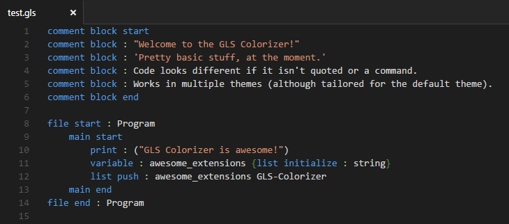

# Visual Studio Code GLS Colorizer

General Language Syntax language support for Visual Studio Code.
Adds syntax colorization for .gls files.

## Features

The GLS Colorizer distinguishes all commands, command info, quotations and brackets with their own color.



## Running/Testing

In order to run/test/fiddle with the GLS Colorizer:

  * Clone this repository
  * Open the repository folder in Visual Studio Code
  * Press ```F5``` to run developer mode for the extension
  * Create a new file with the ```.gls``` extension
  * Modify the .tmLanguage file to change the Colorizer
  * Code in GLS!
