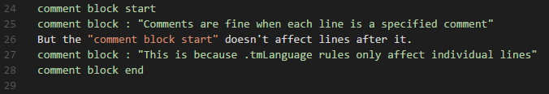

# VSCode GLS Colorizer

General Language Syntax language support for Visual Studio Code.
Adds syntax colorization for .gls files.

## Features

The GLS Colorizer distinguishes all commands, command info, quotations and brackets with their own color.

## Known Issues

*Comment blocks only affect individual lines. 

